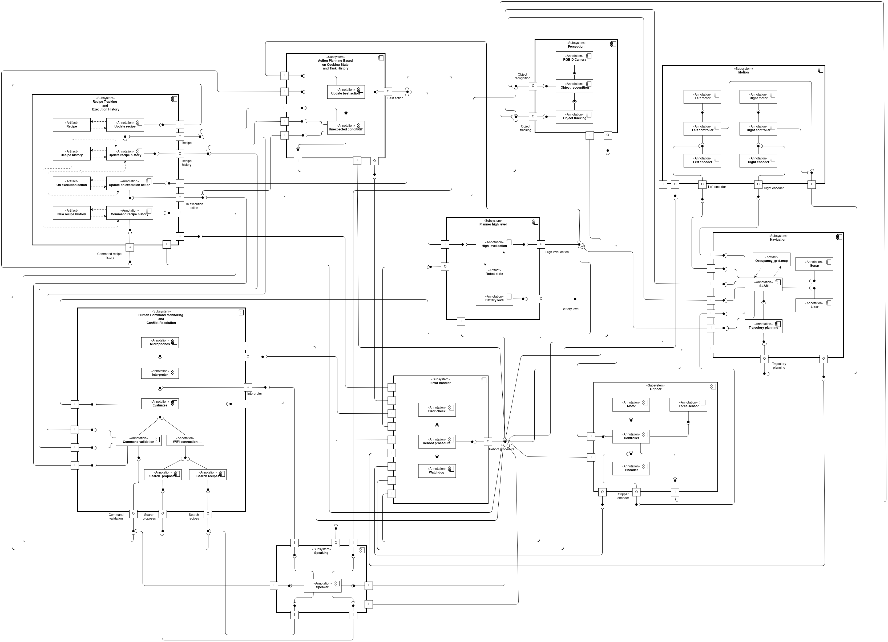

Components diagram
======================

Let's see now each module of this diagram:

.. toctree::
    :maxdepth: 3

    Recipe tracking <components/recipe_tracking.rst>
    Action planning <components/action_planning.rst>
    Humman command <components/human_command.rst>
    Planner <components/planner.rst>
    Perception <components/perception.rst>
    Motion <components/motion.rst>
    Navigation <components/navigation.rst>
    Gripper <components/gripper.rst>
    Error handler <components/error_handler.rst>
    Speaker <components/speaker.rst>